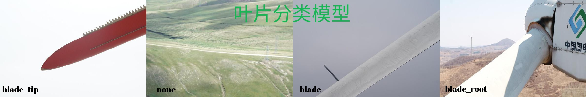
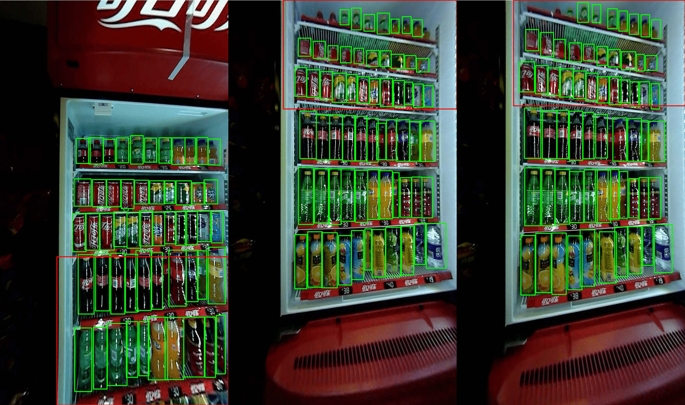
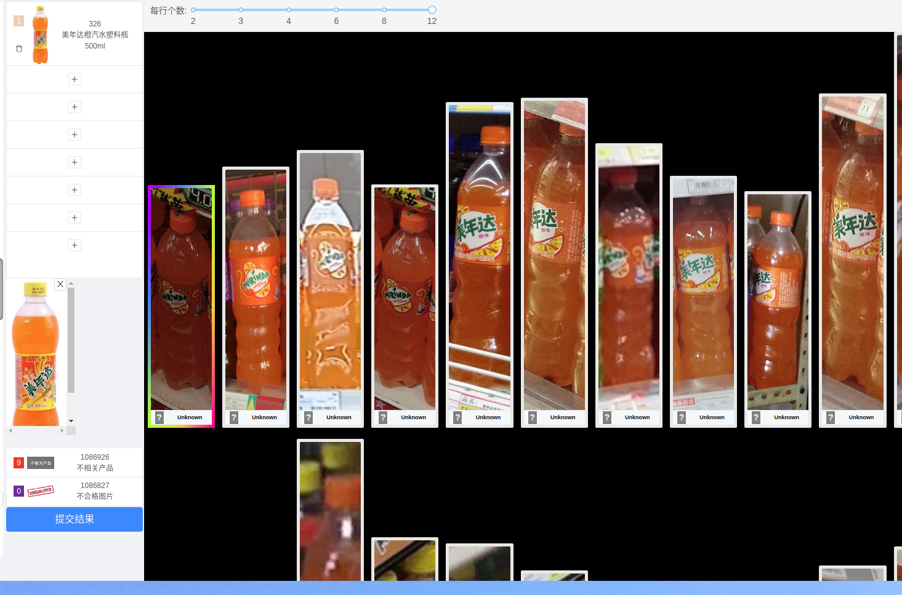

## 个人信息
- 姓名：jzx/男 
- 学历：硕士/华北电力大学
- Email：jia6120@163.com
- 微信：sswjzx
- 期望工作城市和职位：济南/算法工程师 

---

## 项目经历 

---    
### *A 风电项目(无人机叶片自动巡检系统)*
- 项目描述：主要利用无人机进行自动巡检。无人机自动规划路径,对风机进行叶片数据采
集,从而对叶片进行缺陷检测和分析。
#### (0) BladeClassification 轻量网络的叶片类型模型
- 关键词：轻量网络/mobilenet/ros/tensorrt 
  
#### (1) BladeSegmentation Real time的叶片分割模型
- 关键词： bisenet/segmentation/real-time

#### (2) BladeTipLocation 叶尖位置回归模型
- anchor-free/heatmap/detection as point

#### (3)Auto Exposure
- 关键词：noise/motion-blur/exposure-value/Optimal Step Size
---    

### *B 零售项目(智慧冰箱零售)*

- 项目描述:利用摄像头捕获冰箱内产品，统计销量与数据
#### (0) BottleDetection

- 关键词:yolov5/resnet/small object detection

#### (1) 产品快速上线标注工具

- 关键词：embedding/knn/faiss/label-tool

---    

## 开源项目

--- 
#### (0) waste-sort by DeepLearning

#### (1)Structured-Light-Scanner

#### (2)wind-speed forcast by deeplearning

## 个人描述

- 深度学习和机器人开发相关经验
- 较为扎实的编程和算法基础
- 为人友善，性格开朗
      
---      
## 致谢
感谢您花时间阅读我的简历，期待能有机会和您共事。
