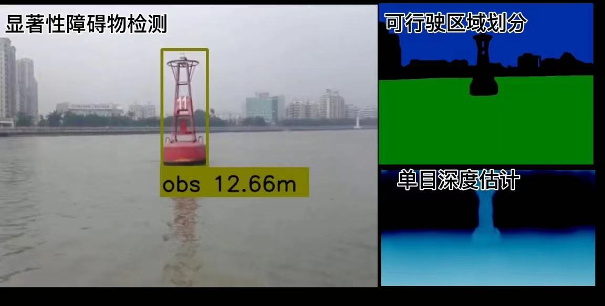

## 个人信息
- 姓名：jzx/男 
- 学历：硕士/华北电力大学
- Email：jia6120@163.com   

---

## 工作经历

|  工作单位   | 时间  | 内容  |
|  ----  | ----  |---  |
| 扩博智能  | 2018.04-2021.5 |算法工程师  |
| 中科院空天信息技术研究院  | 2021.5-2021.10 |算法工程师  |
| 国网智能  | 2021.11- |算法工程师  |

---

## 项目经历 

---    
### ***A 风电项目(无人机叶片自动巡检系统)***

- 项目描述：主要利用无人机进行自动巡检。无人机自动规划路径,对风机进行叶片数据采
集,从而对叶片进行缺陷检测和分析。

---  
#### **(0) BladeClassification 轻量的叶片类型模型**
- 关键词：轻量网络/mobilenet/ros/tensorrt 

 

#### **(1) BladeSegmentation Real-time的叶片分割模型**
- 关键词： bisenet/segmentation/real-time

 

#### **(2) BladeTipLocation 叶尖位置回归模型**
- 关键词：anchor-free/heatmap/detection as point

 

#### **(3) Auto Exposure 叶片前景分割的自动曝光**

- 关键词：noise/motion-blur/exposure-value/Optimal Step Size

---    

### ***B 零售项目(智慧冰箱零售)***

- 项目描述:以智慧冰柜为载体的智慧零售项目，在冰柜上加装摄像头，通过摄像头的数据统计货物的陈列展示和销售情况

---  
#### **(0) BottleDetection**

- 关键词:yolov5/resnet/small object detection

#### **(1) fast onboarding label-tool**

- 关键词：embedding/knn/faiss

---    
### ***C 手持slam建模***

- 项目描述：利用slam技术对所扫描的场景进行三维建模

- 关键词：slam/3d-modeling/3d-reconstruction

---    

### ***D USV视觉感知***

- 项目描述：利用单目摄像头对无人船的可行驶区域，障碍物进行划分和检测
- 关键词：segmentation/obstacles-detection

---    
  
***E 开源项目***

--- 
#### **[waste-sort by DeepLearning](https://github.com/jzx-gooner/DL-wastesort)  |   [Structured-Light-Scanner](https://github.com/jzx-gooner/Structured-Light-Scanner) | [Wind-Speed Forcast](https://github.com/jzx-gooner/mypaper) |[YOLO-DEEPSORT](https://github.com/jzx-gooner/yolov5_deepsort_ros)**

---

## 个人描述

- 深度学习和机器人开发相关经验
- 较为扎实的编程和算法基础
- 为人友善，性格开朗
      
---      
## wechat

